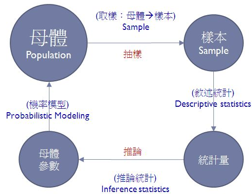

#  機率與統計

## 簡介

在現實的生活當中，有許多我們無法準確描述的現象，這些現象的出現包含了某種程度的隨機性。舉例而言，我們無法精確的預知明天是否會下雨、股票會漲或者會跌、匯率會如何波動，人會不會生病等等。

但是當這些現象出現的總體量很多的時候，我們就可以「統計」出該事件發生的「機率」，於是我們的天氣預報可以預測明天下雨的機率、我們也可以統計出股票漲跌的機率、人們生病的機率、或者某人買了一張彩券後中獎的機率等等。

因此，機率與統計可以說是一體的兩面，當我們知道某個基本事件的先驗機率1時，我們可以根據此一機率計算某個組合事件發生的機率。例如我們可以知道兩顆公平的骰子同時出現 6 點的機率是 1/36 ，而連續投擲公平的銅版五次，每次都是正面的機率為 1/32等。

但是當我們不知道基本事件的發生機率時，我們該怎麼辦呢？此時統計的價值就顯現出來了，我們可以先進行很多次的實驗，以便透過計算的方式算出某個「事件」的機率，這種統計方法就稱為「敘述統計」。接著我們可以根據這個統計的結果，推論出某些衍生事件的機率，或者推算出此一事件是否「可信」，這樣的統計就稱為「推論統計」。

如果用更數學化的語言來說，我們可以透過已知的「母體模型」，以及某些「母體參數」計算某個事件的機率，或者用電腦隨機產生這些事件。這種用參數與模型產生隨機事件的過程，可以用電腦的方是透過程式模擬產生，此時電腦其實是以機率的角度在模擬母體的運作方式，這樣的電腦模擬方法稱為「蒙地卡羅法」。

但是如果我們是在是先取得一群樣本之後，開始計算樣本的某個統計量是多少，這種計算就稱為「敘述統計」。如果我們進一步透過「敘述統計」的「統計量」去推估「母體的某個參數值應該是多少？」，這樣的推估方法就稱為「推論統計」。

下圖顯示了「母體、參數、樣本與統計量」之間的關係。
 


如果我們精確知道母體的機率模型與參數，我們就完全掌握了母體的機率分布，這就是從機率角度的看法。但是在很多情況下我們無法清楚的知道母體的模型與參數，此時我們就可以採用「抽樣的方式」，從母體中取得或觀察到某些「樣本」，再透過這些樣本去計算出某些「敘述統計量」，接著再用這些統計量去推估母體的參數。

## 機率理論

舉例而言，假如我們已經某個銅版是公平的，也就是兩面的機率都是 1/2 ，那麼我們就可以直接透過「機率法則」計算某個序列，例如連續五次都投出正面的機率為    。

但是如果我們不知到銅版「正反面的機率」，那麼我們就必須改用「統計的方法」，例如連續投擲該銅版一千次，然後計算「正面與反面各為多少次」，接著再透過這些「正反面次數的統計量」，去推估某事件的出現機率。

假如我們投擲該銅版一千次的結果，發現正面出現 508  次，反面出現 492 次，那麼我們就可以推估「正面的機率為 0.508」，而「反面出現的機率為 0.492」，接著再去推估連續出現五次正面的機率為    。

當然，機率的模型並不是都像擲骰子或銅版那樣簡單的，有時機率模型本身就有點困難。舉例而言，布瓦松 (Poisson) 分布是用來描述「一段連續時間內」某個隨機事件發生的次數，其離散機率密度函數如下所示。

  

如果沒有學過機率的話，相信一般人很難看懂該機率分布的意義。因此在本書的後序章節中，我們將會先介紹機率的法則與模型，以便讓讀者能先對這些機率模型所代表的意義有清楚的認識，然後再進入「敘述統計」與「推論統計」的數學世界，希望透過這樣的方法，讀者能更清楚的理解整個機率統計的數學理論，並且能用 R 程式的實作來印證這些理論。


## 統計理論

同樣的，統計理論也不只是算算出現次數這麼簡單的。舉例而言，當我們想知道某一組統計量是否「合理」時，我們會採用「信賴區間」的方式描述該組統計量的合理的母體參數範圍，以下是一個範例。

請計算出以下列樣本序列的「平均值之 95% 信賴區間」：

	3.6146570 4.1440593 2.5726955 5.2325581 2.0635500 
	2.6294660 2.8541827 2.4816312 1.5836851 3.2193062 
	2.8205306 3.5037204 2.6107131 4.1870588 2.4506509 
	2.4849244 4.5343839 0.7606934 3.5219675 1.7019120

這樣的計算顯然不是簡單的「計算出現次數」而已。要能進行「信賴區間」的計算，顯然我們必須學習更多的數學理論，才能知道如何計算，也才能清楚的掌握計算結果的意義。

## 應用

機率統計的應用涵蓋面非常的廣，從社會科學到自然科學都會用到，這是一門有著極強實用性的數學，很少數學像機率統計一樣有著如此強大的實用性。

在社會科學當中，我們會用機率統計來檢驗某個抽樣調查是否可信，某個抽樣調查顯示了何種意義等等？甚至像是社會科學領域的經典，塗爾幹的自殺論當中，即是採用機率統計的方法檢驗哪些因子會造成自殺現象的增加或減少等等，這些都是機率統計在社會科學上很明顯的應用案例。

在自然科學當中，學習生物或醫學的研究者也會透過機率統計來計算並研究某個藥物是否對特定疾病具有療效，或者某個檢測結果是否顯示該病人已經得到某種疾病。而學習電腦的程式設計者則可以透過機率統計模型進行「蒙地卡羅式的隨機模擬」，以便計算某個現象的機率。或者透過像「貝氏網路」這樣的機率模型以進行事件的機率計算，甚至是透過像「隱馬可夫鏈算法」(Hidden Markov Model) 或 EM 學習法 (Expectation-Maximization Algorithm) 等方法來學習某個機率模型與參數，以便讓程式能根據輸入樣本得到預測某些事件的能力。這些都是機率統計在自然科學上典型的應用案例。

## R 軟體實作：簡介與基本操作

### 簡介

R 軟體是專門為了機率統計而設計的一種開放原始碼軟體，是免費的自由軟體。

市面上有許多與 R 類似的商用軟體，像是 SPSS, SAS, MINITAB, S-PLUS 等，但是這些軟體是要花錢買的。

R 軟體所使用的程式語言，被稱為 R 語言。

R 語言 與 S-PLUS 所使用的語言很類似，兩者都衍生自貝爾實驗室 Rick Becker, Allan Wilks, John Chambers 所創造的 S 語言，R 語言基本上是 GNU 所實作的 S 語言版本。

筆者篆寫此文時，R 所採用的 S 語言演化到了第四版，因此稱為 S4。

### 安裝

R 軟體的官方網站為 <http://www.r-project.org/> ，其中有個相當重要的子網站稱為 CRAN (Comprehensive R Archive Network)，其網址為  <http://cran.r-project.org/> ，您可以從這個網站中下載 R 軟體。

舉例而言，筆者使用的是 Windows作業系統，因此可以從以下網址下載到最新版的 R 軟體。

* <http://cran.r-project.org/bin/windows/base/>


舉例而言，筆者點選時為 Download R 2.15.2 for Windows 這個連結， 這會下載位於下列網址的檔案：

* <http://cran.r-project.org/bin/windows/base/R-2.15.2-win.exe>

下載完畢後，請啟動該安裝檔，然後不斷按「下一步」就可以完成安裝了，過程非常簡單。

以下網址中的 Youtube 影片介紹了 R 軟體的下載、安裝、套件、網站、電子書等等，有興趣的朋友可以看看。

* <http://www.youtube.com/watch?v=AipnE4s8sKk>

### 基本操作

為了說明 R 軟體的用法，並用以學習機率統計的概念，本系列文章將運用 R 來說明機率統計的理論，讓程式人可以透過實作學會機率統計，並且學會 R 軟體中的 S 語言。

為了避免太過枯燥，我們將不會先介紹 R 的基本語法，而是先用一系列的操作，讓讀者體會 R 的能力，然後再慢慢回到語言的教學上面。

以下是筆者用 R 軟體取樣後會出樣本統計圖的畫面，簡單的幾個指令就可以得到統計結果，是不是很棒呢？


第一個指令 `?rnorm` 是要求 R 軟體查詢 rnorm 這個指令，R 軟體會顯示以下的說明網頁，您可以看到 rnorm 指令是與常態分部 (The Normal Distribution) 有關的。


在 R 軟體中，對於任何一個機率分布 xxxx，都會實作出以 d, p, q, r 為字首的四種函數，例如對於常態分布 Normal Distribution (簡寫為 norm) 而言，就有 dnorm, pnorm, qnorm, rnorm 等四個函數，功能分別如下所示：

函數            說明                            語法
--------        -------------------------       -----------------------------------------------------------------
dnorm           常態分布的機密度函數            dnorm(x, mean = 0, sd = 1, log = FALSE)
pnorm           常態分布的機分布函數            pnorm(q, mean = 0, sd = 1, lower.tail = TRUE, log.p = FALSE)
qnorm           常態分布的分位數函數            qnorm(p, mean = 0, sd = 1, lower.tail = TRUE, log.p = FALSE)
rnorm           常態分布隨機樣本函數            rnorm(n, mean = 0, sd = 1)

上表中的 mean 代表平均數，sd 代表 Standard Deviation (標準差)，n 是隨機產生的樣本個數，x 是隨機變數值，q 是累積值，p 是機率值，n 則是產生的樣本數。

您可以發現函數中，有些參數後面有 = 的指定 (像是 mean=0, sd=1, log=FALSE, ....)，有些卻沒有 (像是 x, q, p, n) 等，這些指定代表預設值，也就是如果您不指定這些參數的値，那麼將會自動代入預設值。

所以 `rnorm(100)` 代表 `rnorm(100, mean = 0, sd = 1)` 的意思，也就是該函數會產生平均數為 mean=0，標準差為 sd=1 的隨機樣本共 100 個。

關於這些函數的更詳細的說明如下表所示。

字首        函數意義            範例                     說明
------      -----------------   -------------------      -----------------------------------------------------------------
d           機率密度函數        dnorm(1.96)              P(X=x)
p           累積機率函數(CDF)   pnorm(1.96)=0.975        P(X≤x)
q           計算百分位數        qnorm(0.975)=1.96        q 系列為 p 系列的反函數; 所以 qnorm(pnorm(1.96)) = 1.96
r           抽樣函數            rnorm(100)               傳回 100 個標準常態分布的樣本向量

看懂這些函數之後，讓我們再度列出上圖的操作指令，仔細觀察看看每一個指令的意義。

```R
?rnorm

x = rnorm(10000, mean=5, sd=4)

hist(x)
```

指令 `x = rnorm(10000, mean=5, sd=4)` 代表我們要用平均值為 5, 標準差為 4 的常態分布，隨機產生 10000 個樣本，然後將這些樣本存到 x 陣列當中。

指令 `hist(x)` 代表要用這些樣本畫出統計的直方圖 (Histogram)，於是就畫出了圖中的那個長條狀圖形。

現在、請讀者試著看看下列操作，看看您是否能夠讀懂這些操作的意義。

```R
rnorm(10, 3, 2)
> x
 [1] 2.5810213 0.5399127 5.0005020 5.3402693 2.7900723 3.9638088 5.2119685
 [8] 2.2209882 2.9935943 7.0308419
> a=dnorm(1.96)
> a
[1] 0.05844094
> b=pnorm(1.96)
> b
[1] 0.9750021
> c=qnorm(b)
> c
[1] 1.96
> d=rnorm(10)
> d
 [1] -0.32913677  0.77788306 -1.80862496  0.16694598 -0.65656254 -1.76305925
 [7]  1.18237502  0.19651748 -0.07898685  0.73970933
> 
```

## 參考文獻
* [維基百科:機率論](http://zh.wikipedia.org/wiki/%E6%A6%82%E7%8E%87%E8%AE%BA)
* [Wikipedia:Probability Theory](http://en.wikipedia.org/wiki/Probability_theory)
* 機率密度函數 PDF (連續) -- <http://en.wikipedia.org/wiki/Probability_density_function>
* 機率質量函數 PMF (離散) -- <http://en.wikipedia.org/wiki/Probability_mass_function>
* <http://en.wikipedia.org/wiki/Statistics>
* <http://en.wikipedia.org/wiki/Descriptive_statistics>
* <http://en.wikipedia.org/wiki/Inferential_statistics>
* <http://en.wikipedia.org/wiki/Bayesian_Inference>
* <http://en.wikipedia.org/wiki/Correlation>
* <http://en.wikipedia.org/wiki/Analysis_of_variance>
* <http://en.wikipedia.org/wiki/Design_of_experiments>
* <http://en.wikipedia.org/wiki/Regression_analysis>
* <http://en.wikipedia.org/wiki/Student%27s_t-test>
