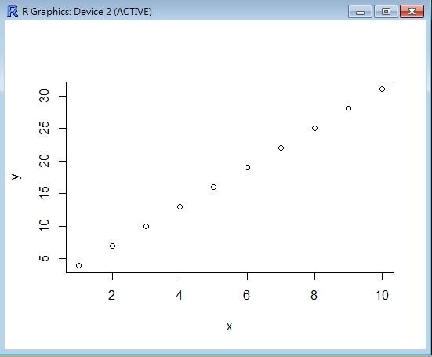
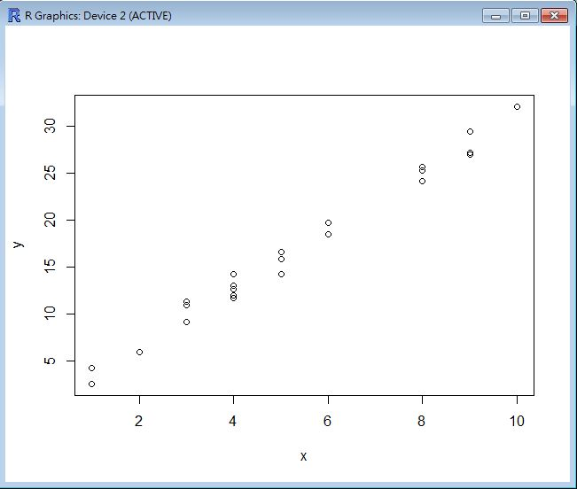

# 迴歸分析

## 簡介

在「點估計」與「區間估計」當中，被估計的對象是一個點的座落點或區域。但是、如果我們想要找尋的是，
兩個以上變數之間的「運算式」關係，那麼就不能只用「估計」了，而必須採用「迴歸分析」的方法。

迴歸分析是在尋找這些變數之間的關係，通常是尋找「線性關係」，舉例而言，假如我們認為 y 與 x 之間具有線性關係，也就是
y 是 x 的線性函數，那麼我們可以將兩者之間的關係寫成 y= a + b * x ，其中 a 與 b 都是某個未知的常數。

當我們取得了很多組 (x,y) 的樣本 (x1, y1) (x2, y2) ..... (xk, yk) 時，我們就可以透過迴歸分析來尋找出這些未知的常數，
進而建立變數之間的線性方程關係式。

## R 軟體中的 lm() 函數

在 R 軟體當中，用來做迴歸分析的是 lm() 函數，其函數原型如下：

* lm(formula, data, subset, weights, na.action, method = "qr", model = TRUE, x = FALSE, y = FALSE, qr = TRUE, singular.ok = TRUE, contrasts = NULL, offset, ...)

通常，我們只要用到 formula 與 data 兩個參數就可以進行迴歸運算了，舉例而言，假如我們有 25 個樣本 xy = (x1, y1) (x2, y2) .... (x25, y25)，那麼我們就
可以用下列 lm 函數找出 x, y 之間的線性關係式。

* lm(y~x, xy)

當然、如果自變數不只一個，例如我們想尋找的是 y = a + b1 * x1 + b2 * x2 的話，那麼就可以用下列函數去計算出 a, b1, b2 等係數，以建立迴歸模型。

* lm(y~x1+x2, xy)


## 單一自變數的迴歸分析：完全線性，無誤差值

現在、就讓我們用 R 軟體來示範「迴歸分析」的做法，

```R
> x = sample(1:10, 25, replace=TRUE) # 從 1 到 10 之中可重複的隨機抽出 25 個樣本
> x
 [1]  7  1  9  4  1  2 10  6  3  3 10  9  5  9  5 10  2  1  8  4  8  7  4  6
[25]  9
> y = 1+3*x　 # 用這些 x 樣本透過線性關係式產生 y 樣本，這是完美的線性關係，完全沒有誤差。
> y
 [1] 22  4 28 13  4  7 31 19 10 10 31 28 16 28 16 31  7  4 25 13 25 22 13 19
[25] 28
> plot(x,y)　# 畫出 (x,y) 的圖形，您會發現所有點都分布在一條斜率為 3 的斜線上
```



```
> xy = data.frame(x, y)　# 讓 (x,y) 的配對形成 frame 變數，這樣才能做為 lm(formula, data) 中的 data 參數。
> xy
    x  y
1   7 22
2   1  4
3   9 28
4   4 13
5   1  4
6   2  7
7  10 31
8   6 19
9   3 10
10  3 10
11 10 31
12  9 28
13  5 16
14  9 28
15  5 16
16 10 31
17  2  7
18  1  4
19  8 25
20  4 13
21  8 25
22  7 22
23  4 13
24  6 19
25  9 28
> model = lm(y~x, data=xy) # 開始作線性迴歸分析
> model

Call:
lm(formula = y ~ x, data = xy)

Coefficients:
(Intercept)            x  
          1            3  
```

上述的線性回歸函數 lm，果真找到的原來的關係式，也就是「截距 =1、x 係數 =3 」的 「y=1+3*x」的算式，完整的還原了 y 與 x 之間的關係。

## 單一自變數的迴歸分析：有誤差值

上述的範例雖然很完美，但是卻很不真實，因為在機率統計的世界中，通常有很多難以捕捉的「隨機性誤差」，反應在樣本上面。

現在、就讓我們再度進行一次迴歸分析，只不過這次我們將加入一些常態分布的誤差值進去。

```R
> x = sample(1:10, 25, replace=TRUE)  # 從 1 到 10 之中可重複的隨機抽出 25 個樣本
> x
 [1] 10  1  9  9  4  3  5  6  4  5  9  4  6  8  8  1  8  3  5  4  8  2  5  4
[25]  3
> y = 1 + 3*x + rnorm(25, mean=0, sd=1) # 用這些 x 樣本透過線性關係式產生 y 樣本，其中的誤差是用 rnorm() 產生的。
> y
 [1] 32.084945  2.594432 26.981934 29.395315 11.737131 11.347425 14.292503
 [8] 18.543848 12.025822 15.848780 27.211809 13.063985 19.708064 24.161863
[15] 25.271777  4.317383 25.694476  9.167196 15.871665 14.244046 24.165393
[22]  5.994046 16.639490 12.682938 10.978489
> plot(x,y)
```



```R
> xy = data.frame(x,y)　# 讓 (x,y) 的配對形成 frame 變數，這樣才能做為 lm(formula, data) 中的 data 參數。
> xy
    x         y
1  10 32.084945
2   1  2.594432
3   9 26.981934
4   9 29.395315
5   4 11.737131
6   3 11.347425
7   5 14.292503
8   6 18.543848
9   4 12.025822
10  5 15.848780
11  9 27.211809
12  4 13.063985
13  6 19.708064
14  8 24.161863
15  8 25.271777
16  1  4.317383
17  8 25.694476
18  3  9.167196
19  5 15.871665
20  4 14.244046
21  8 24.165393
22  2  5.994046
23  5 16.639490
24  4 12.682938
25  3 10.978489
> model2 = lm(y~x, xy, x=T) # 開始作線性迴歸分析
> model2 # 顯示分析結果，發現 截距 intercept 為　0.5345, 且 x 的係數為 3.1447，也就是 y=0.5345+3.1447*x，這與原產生式「y = 1 + 3*x + 誤差」有些差異，但還不錯。

Call:
lm(formula = y ~ x, data = xy, x = T)

Coefficients:
(Intercept)            x  
     0.5345       3.1447  

> model2$x
   (Intercept)  x
1            1  5
2            1  7
3            1  8
4            1  4
5            1  3
6            1  2
7            1  3
8            1  4
9            1  5
10           1  4
11           1  7
12           1  7
13           1  2
14           1  4
15           1  2
16           1 10
17           1  7
18           1  3
19           1  3
20           1  2
21           1  7
22           1  5
23           1 10
24           1  7
25           1 10
attr(,"assign")
[1] 0 1
> 
```

## 數學原理

那麼、這種迴歸分析到底是根據甚麼原理所設計出來的呢？讓我們從數學的角度看一下這個問題。

對於一組 (X,Y) 樣本而言，假如有 n 個樣本，則可以表示為    ，
如果我們想找出一組線性方程式描述 X, Y 之間的關係，那麼可以寫成如下公式：

     ; 其中 i=1,2,....,n, 且   

接著我們就必須從 (X,Y) 這組資料樣本中，進行    的估計，以便讓該線性函數能盡可能的逼近這些樣本。

我們可以採用「最小二乘法」來進行估計，也就是找出讓下方程式得到最小值的    ：

  

要找上述方程式的最小值，我們可以對     分別進行微分，最小值會出現在導數為零的地方，推論如下：

  

  

但必須注意的是，不管對於哪種 (X,Y) 樣本，最小二乘法都會找出迴歸線，但是如果 (X, Y) 兩者之間根本沒有線性關係，
此時找出線性迴歸也就沒有甚麼意義了。

那麼我們怎麼知道兩者之間有沒有線性關係呢？這可以採用下列檢定方法。

1. t 檢驗法
2. F 檢驗法
3. 相關係數檢驗法。

## 兩組自變數的迴歸分析：完全線性，無誤差值

當然、我們不只可以做單一自變數的迴歸，也可以做多組自變數的迴歸，以下讓我們用 R 軟體來示範 
`y=a + b1 * x1 + b2 * x2` 迴歸式的分析。

```R
> x1 = sample(1:10, 25, replace=TRUE) # 產生第一個自變數的 25 個樣本值
> x2 = sample(1:8, 25, replace=TRUE) # 產生第二個自變數的 25 個樣本值
> y = 5 + 3 * x1 - 2 * x2 # 用這些 (x1, x2) 樣本透過線性關係式產生 y 樣本，這是完美的線性關係，完全沒有誤差。
> x1
 [1]  8  8  8  2  6  3  4  1  5  4  2  1  6  4  2  4  1  5  7  2  9  2 10  4
[25]  5
> x2
 [1] 7 7 1 8 5 5 5 2 6 8 5 7 4 6 8 5 6 8 2 5 7 2 7 6 5
> y
 [1] 15 15 27 -5 13  4  7  4  8  1  1 -6 15  5 -5  7 -4  4 22  1 18  7 21  5
[25] 10
> yx12 = data.frame(y, x1, x2)　# 讓 (y, x1, x2) 的配對形成 frame 變數，這樣才能做為 lm(formula, data) 中的 data 參數。
> yx12.model = lm(y~x1+x2, yx12) # 開始作線性迴歸分析
> yx12.model # 顯示分析結果，發現 截距 intercept 為　5, 且 x1 的係數為 3，x2 的係數為 -2 也就是 y=5+3*x1-2*x2，正確找出我們產生資料用的算式。

Call:
lm(formula = y ~ x1 + x2, data = yx12)

Coefficients:
(Intercept)           x1           x2  
          5            3           -2  

> 

```

## 兩組自變數的迴歸分析：有誤差值

同樣的，對於兩組或多組自變數的情況，我們也可以加入「隨機誤差值」，來讓整個資料集更有真實感，以下是我們的「資料產生」與「迴歸分析」的過程。

```R
> x1 = sample(1:10, 25, replace=TRUE) # 產生第一個自變數的 25 個樣本值
> x2 = sample(1:8, 25, replace=TRUE) # 產生第二個自變數的 25 個樣本值
> y2 = 5 + 3*x1-2*x2 + rnorm(25, mean=0, sd=5)
> y2x12 = data.frame(y2, x1, x2)　# 讓 (y, x1, x2) 的配對形成 frame 變數，這樣才能做為 lm(formula, data) 中的 data 參數。
> y2x12
           y2 x1 x2
1  10.2069412  8  7
2  11.5760467  8  7
3  24.8724883  8  1
4  -3.4406110  2  8
5   9.0650415  6  5
6   8.2621227  3  5
7  18.7755635  4  5
8  -5.1753518  1  2
9  14.1795708  5  6
10 -2.9588236  4  8
11  4.4931402  2  5
12 -9.1706740  1  7
13 15.7826413  6  4
14 11.1684672  4  6
15 -4.2108325  2  8
16 14.0557877  4  5
17  2.9787818  1  6
18  0.2277253  5  8
19 31.3466157  7  2
20 11.2311146  2  5
21 17.9397316  9  7
22  6.1773147  2  2
23 17.5177323 10  7
24  1.1189083  4  6
25 15.5696626  5  5
> y2x12.model = lm(y~ x1+x2, y2x12) # 開始作線性迴歸分析
> y2x12.model # 顯示分析結果，發現 截距 intercept 為　5.315, 且 x1 的係數為 2.886，x2 的係數為 -1.997，也就是 y=5.315+2.886*x1-1.997x2，這與原產生式 「y = 5 + 3*x1-2*x2+誤差」有些差異，但還不錯。

Call:
lm(formula = y ~ x1 + x2, data = y2x12)

Coefficients:
(Intercept)           x1           x2  
      5.315        2.886       -1.997  

> 

```

## 結語

透過上述的實驗，我們可以發現在沒有誤差的情況下，線性迴歸函數 lm() 都可以找出正確的模型，得到正確的「截距」與「係數值」，
而在有隨機誤差的情況下，線性迴歸函數 lm() 雖然沒有辦法完全環原正確的模型，但是也找到還算不錯的結果，這正是「迴歸分析」
這個工具的威力之所在阿！

## 參考文獻
* [R 統計軟體(4) – 平均值的估計與檢定](https://dl.dropboxusercontent.com/u/101584453/pmag/201306/htm/article3.html)
* [R 統計軟體(5) – 再探檢定](http://programmermagazine.github.io/201307/htm/article3.html)
* 陳鍾誠的網站/免費電子書/R 統計軟體 -- <http://ccckmit.wikidot.com/r:main>
* 陳鍾誠的網站/免費電子書/機率與統計 (使用 R 軟體) -- <http://ccckmit.wikidot.com/st:main>
